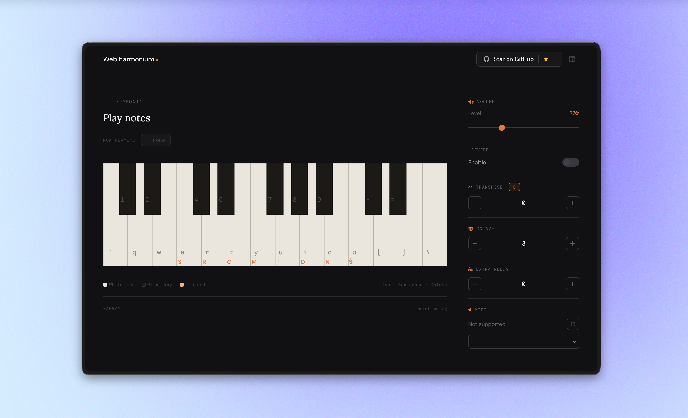

# Web Harmonium 🎵

A real sampled harmonium player in your browser. No plugin needed.

## Features

- **Play with Keyboard** - Use your computer keyboard to play ragas
- **MIDI Support** - Connect your MIDI device for authentic control
- **Sargam Notation** - Learn and log Indian classical music notation
- **Reverb Effects** - Add acoustic space to your playing
- **Octave Control** - Explore different octaves
- **Extra Reeds** - Add harmonic richness with stacked notes

## Quick Start

1. Open `index.html` in your browser
2. Click "Load Instrument"
3. Allow keyboard input when prompted
4. Start playing!

## How to Play

### Keyboard Mapping
- **White Keys**: `` ` q w e r t y u i o p [ ] \``
- **Black Keys**: `1 2 4 5 7 8 9 - =`
- **Notation**: Keys auto-generate Sargam notation
- **Controls**: 
  - `Tab` - Add comma to notation
  - `Backspace` - Delete last character
  - `Delete` - Clear notation

### Controls
- **Volume** - Adjust with slider
- **Reverb** - Toggle for acoustic effect
- **Transpose** - Change root note (-11 to +11 semitones)
- **Octave** - Switch between octaves (0-6)
- **Extra Reeds** - Add parallel notes (0-6)
- **MIDI** - Connect and select MIDI device

## Files

- `index.html` - Main application
- `manifest.json` - PWA configuration
- `robots.txt` - SEO crawler directives
- `sitemap.xml` - Search engine sitemap
- `.htaccess` - Server configuration
- `favicon/` - App icons for all platforms
- `harmonium-kannan-orig.wav` - Harmonium sample
- `reverb.wav` - Reverb impulse response
- `og-image.png` - Social media preview image

## SEO & PWA

✅ SEO Optimized (Meta tags, Open Graph, Schema)
✅ Progressive Web App (Installable, Offline ready)
✅ Mobile Friendly
✅ Fast Loading (Gzip compression, caching)
✅ Secure (HTTPS ready, security headers)

## Browser Support

- Chrome/Edge 90+
- Firefox 88+
- Safari 14+
- Mobile browsers (landscape mode recommended)

## Credits

Built with Web Audio API and HTML5

---
